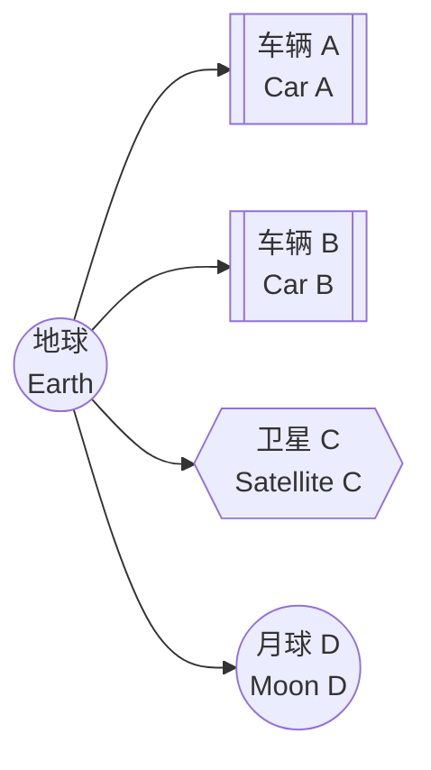

# Tf2

### 目录

  * [概述](https://www.google.com/search?q=%23overview)
  * [tf2 的特性](https://www.google.com/search?q=%23properties-of-tf2)
  * [发布变换](https://www.google.com/search?q=%23publishing-transforms)
  * [位置 (Position)](https://www.google.com/search?q=%23position)
  * [速度 (Velocity)](https://www.google.com/search?q=%23velocity)
  * [教程](https://www.google.com/search?q=%23tutorials)
  * [论文](https://www.google.com/search?q=%23paper)

-----

### 概述 (Overview)

tf2 是一个变换（transform）库，它允许用户随时间跟踪多个坐标系。tf2 在一个时间缓冲的树形结构中维护坐标系之间的关系，并允许用户在任意所需的时间点，在任意两个坐标系之间转换点、向量等数据。

### tf2 的特性 (Properties of tf2)

一个机器人系统通常拥有许多随时间变化的 3D 坐标系，例如世界坐标系（world frame）、基座坐标系（base frame）、夹爪坐标系（gripper frame）、头部坐标系（head frame）等。tf2 会随时间跟踪所有这些坐标系，并允许您提出如下问题：

  * 5 秒前，头部坐标系相对于世界坐标系在哪里？
  * 我的夹爪中的物体相对于我的基座的位姿（pose）是什么？
  * 基座坐标系在地图坐标系中的当前位姿是什么？

tf2 可以在分布式系统中运行。这意味着关于机器人坐标系的所有信息都可供系统中任何计算机上的所有 ROS 2 组件使用。tf2 可以让分布式系统中的每个组件构建自己的变换信息数据库，或者拥有一个中心节点来收集和存储所有变换信息。

### 发布变换 (Publishing transforms)

在发布变换时，我们通常将其视为从一个坐标系到另一个坐标系的变换。语义上的区别在于，你是在变换**在一个坐标系中表示的数据**，还是在变换**坐标系本身**。这些值是直接互逆的。在 `geometry_msgs/msg/Transform` 消息中发布的变换表示的是坐标系的构型（frame formulation）。在调试发布的变换时请记住这一点：它们是你根据遍历变换树的方向进行查找（lookup）时的逆运算。

$$
{}_{B}T^{data}_{A} = ({}_{B}T^{frame}_{A})^{-1}
$$TF 库会根据你遍历变换树的方向，自动为你处理这些元素的求逆。在本文档的其余部分，我们将仅使用 $T^{data}$，但 $data$ 上标通常是省略不写的。

### 位置 (Position)

如果车辆 A 中的驾驶员观察到了某物，而地面上的人想知道该物体相对于他们的位置，你需要将观察结果从源坐标系（Source Frame）变换到目标坐标系（Target Frame）。

$${}*{E}T*{A} \* P\_{A}^{Obs} = P\_{E}^{Obs}
$$现在，如果车辆 B 中的人也想知道该物体在哪里，你可以计算净变换（net transform）：

$$
{}_{B}T_{E} * {}_{E}T_{A} * P_{A}^{Obs} = {}_{B}T_{A} * P_{A}^{Obs} = P_{B}^{Obs}
$$这正是 `lookupTransform` 所提供的功能，其中 `A` 是 `source_frame_id`（源坐标系 ID），`B` 是 `target_frame_id`（目标坐标系 ID）。

建议尽可能使用 `transform<T>(target_frame, ...)` 方法，因为它们会从数据类型中读取 `source_frame_id`，并将 `target_frame_id` 写入结果数据类型中，内部会自动处理数学计算。

如果 $P$ 是一个 `Stamped`（带时间戳）的数据类型，那么 `_A` 就是它的 `frame_id`。

举个例子，如果根坐标系 `A` 在坐标系 `B` 下方 1 米处，从 `A` 到 `B` 的变换是正值（高度增加）。
然而，当将**数据**从坐标系 `B` 转换到坐标系 `A` 时，你必须使用该值的逆。这可以理解为：当你切换到较低的参考坐标系时，你需要给高度增加数值。但是，如果你是将数据从坐标系 `A` 变换到坐标系 `B`，高度会减小，因为新的参考系更高。

$${}*{B}T*{A} = ({}*{B}{Tf}*{A})^{-1}
$$\#\#\# 速度 (Velocity)

为了表示 **速度 (Velocity)**，我们有三部分信息：$V^{moving\_frame - reference\_frame}_{observing\_frame}$。
该速度表示“移动坐标系”与“参考坐标系”之间的速度，并且它是在“观察坐标系”中表示的。

例如，车辆 A 中的驾驶员可以报告他们正以 1m/s 的速度向前行驶（在 A 中观察，相对于地球），那么这将是：
$$V_{A}^{A - E} = (1,0,0)$$
而在地球的视角下观察同样的速度（假设汽车向东行驶，且地球坐标系为北东地 NED），则会是：
$$V_{E}^{A - E} = (0, 1, 0)$$

然而，变换可以表明这两者实际上是相同的：

$$
{}_{E}T_{A} * V_{A}^{A - E} = V_{E}^{A - E}
$$如果速度是在同一个坐标系（本例中为 `Obs`）中表示的，则可以进行加减运算：

$$V\_{Obs}^{A - C} = V\_{Obs}^{A - B} + V\_{Obs}^{D - C}
$$速度可以通过求逆来“反转”：

$$
V_{Obs}^{A - C} = -(V_{Obs}^{C - A})
$$如果你想比较两个速度，必须首先将它们变换到同一个观察坐标系中。

### 教程 (Tutorials)

我们创建了一套 **教程** (`../../Tutorials/Intermediate/Tf2/Tf2-Main`)，一步步指导您使用 tf2。您可以从 **tf2 简介** (`../../Tutorials/Intermediate/Tf2/Introduction-To-Tf2`) 教程开始。要查看所有 tf2 及相关教程的完整列表，请查看 **教程** (`../../Tutorials/Intermediate/Tf2/Tf2-Main`) 页面。

用户使用 tf2 本质上有两个主要任务：**监听变换 (listening for transforms)** 和 **广播变换 (broadcasting transforms)**。

* **监听变换：** 如果您想使用 tf2 在坐标系之间进行转换，您的节点需要监听变换。您要做的是接收并缓冲系统中广播的所有坐标系，并查询帧之间的特定变换。请查看 **"编写监听器 (Writing a listener)"** 教程（[Python版](../../Tutorials/Intermediate/Tf2/Writing-A-Tf2-Listener-Py) / [C++版](../../Tutorials/Intermediate/Tf2/Writing-A-Tf2-Listener-Cpp)）以了解更多信息。

* **广播变换：** 要扩展机器人的能力，您需要开始广播变换。广播变换意味着向系统的其余部分发送坐标系的相对位姿。一个系统可以有许多广播器，每个广播器提供关于机器人不同部分的信息。请查看 **"编写广播器 (Writing a broadcaster)"** 教程（[Python版](../../Tutorials/Intermediate/Tf2/Writing-A-Tf2-Broadcaster-Py) / [C++版](../../Tutorials/Intermediate/Tf2/Writing-A-Tf2-Broadcaster-Cpp)）以了解更多信息。

* **静态广播：** 此外，tf2 可以广播随时间不变的静态变换。这主要节省了存储和查找时间，但也减少了发布开销。您应该注意，静态变换只发布一次，并假定不会更改，因此不存储历史记录。如果您想在 tf2 树中定义静态变换，请查看 **"编写静态广播器 (Writing a static broadcaster)"** 教程（[Python版](../../Tutorials/Intermediate/Tf2/Writing-A-Tf2-Static-Broadcaster-Py) / [C++版](../../Tutorials/Intermediate/Tf2/Writing-A-Tf2-Static-Broadcaster-Cpp)）。

* **添加坐标系：** 您还可以在 **"添加坐标系 (Adding a frame)"** 教程（[Python版](../../Tutorials/Intermediate/Tf2/Adding-A-Frame-Py) / [C++版](../../Tutorials/Intermediate/Tf2/Adding-A-Frame-Cpp)）中学习如何向 tf2 树添加固定和动态坐标系。

* **时间与Tf2：** 完成基础教程后，您可以继续学习关于 tf2 和时间的内容。**tf2 与时间** 教程讲授了 tf2 和时间的基本原理。关于 tf2 和时间的**进阶教程**则讲授了使用 tf2 进行时间旅行的原理。

### 论文 (Paper)

TePRA 2013 上发表了一篇关于 tf2 的论文：[tf: The transform library](https://ieeexplore.ieee.org/abstract/document/6556373)。
$$